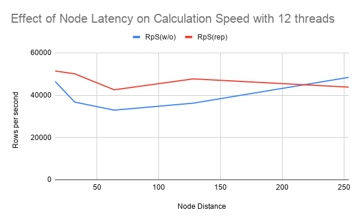
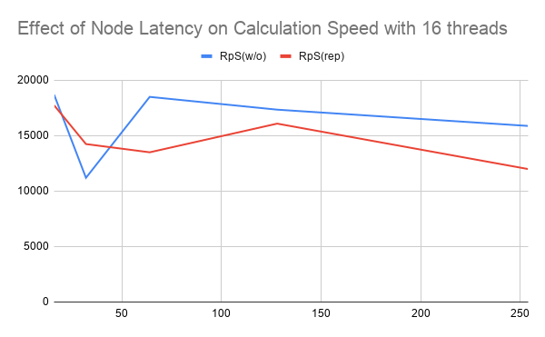

# Does node replication work effectively in a high latency system
In several modern server architecture, it's common to link entirely separate machines together in a manner not dissimilar to the way numa nodes arranged in other systems.  

One major issue that arises from this is that when these machines are told to actively work together to accomplish jobs, memory contention becomes a major issue. Since each machine needs access to the same memory we commonly encounter race conditions, and with the added complexity of the latency between these machines, it can massively slow down jobs when you take this into account while designing.  

To try to solve this issue, we look again to the numa architecture that these systems so clearly emulate. Numa nodes are able to deal with the issue of memory contention via the process of node replication. Numa jobs that use node replication have each node hold a local copy of all shared data so that processes don't have to default to a central node for memory accesses, instead, when reading information, they can access the much faster local copy. To ensure that all nodes have up to date information, whenever a write is performed to the shared memory, the node that did it will send the new information to each other node.  

We hypothesized that by implementing node replication in a similar system where the primary difference is a larger latency between nodes, we'd see a proportionally better speedup in the performance of the jobs that employ node replication compared to without.

## Our setup
To test this hypothesis, we set up a QEMU environment with 4 numa nodes, 3 nodes would be treated as satellite systems, relatively close to one another, while the 4th would be a server with high latency. To see how this would perform we ran a program to generate high terms of the pascals triangle sequence.  

In the run that didn't employ node replication the 4th node, acting as a server, would have a shared array of the previously computed terms of the sequence. we would then have threads running simultaneously on all 4 nodes to compute the next row of terms in parallel. The threads on the other three nodes would need to regularly read and write to the the server node.  

In the run that employed node replication, each node had it's own copy to read from for the calculations. To ensure a level of fairness, the 4th node was still set at a distance from the other three. At the end of each row of calculations, each thread would send the other nodes their calculated terms.  

To see the effects of latency on this example, we ran teh code with several values of artifical latency, ranging from 16ms to 254ms. Additionally, we tried adding more threads per node to see if the amount of memory contention would have a particular impact on the usefulness of node replication.

#### Difficulties with setup
Both members of our team were unfamiliar with both numa and QEMU going into this project. Additionally, while we ended up settling on using one members desktop for all test measurements, due to differences in hardware and OS of our machines, there were some instances where one of us would work on a part of the project, only for it to not work quite right when the other tried to run it.  

Shoutout to Derek, he was only in the group for 4 weeks before having to drop the class for medical reasons, and he is still nearly the most productive person on the team due to the sheer speed he worked while he was with us.

## Results
We expected that for low latency values, the overhead of having to copy each write to the other three nodes would cause the replication-free version to be significantly faster than using replication, while at high latency values, the ability to do quick lookups would allow the code employing node replication to lose minimal speed.  

Surprisingly, while we were correct in assuming that the replication overhead wouldn't be worth it for low latency values, even when we went to the max allowed latency by QEMU (254), while the code employing node replication slowed down slower proportional to it's speed at high latency, it barely outperformed the non-replication in the best of cases, and aside from that it tended to still be worse.

## Conclusion
The result of our testing indicates that node replication provides a insufficient optimization for systems with high latency nodes.  

### Future
While the cases that we tested indicate that the overhead of having to transmit data several times over high latency nodes outweighs the benefits of being able to read locally, both benchmark functions we implemented, including the one we didn't store data for, were for comparatively write heavy operations. For something more read-heavy—like allowing nodes to simply access a database to do local operations—this architecture may be more useful.